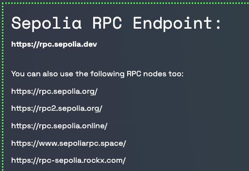
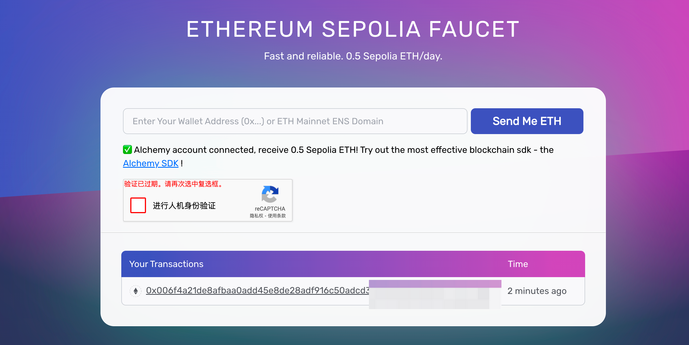
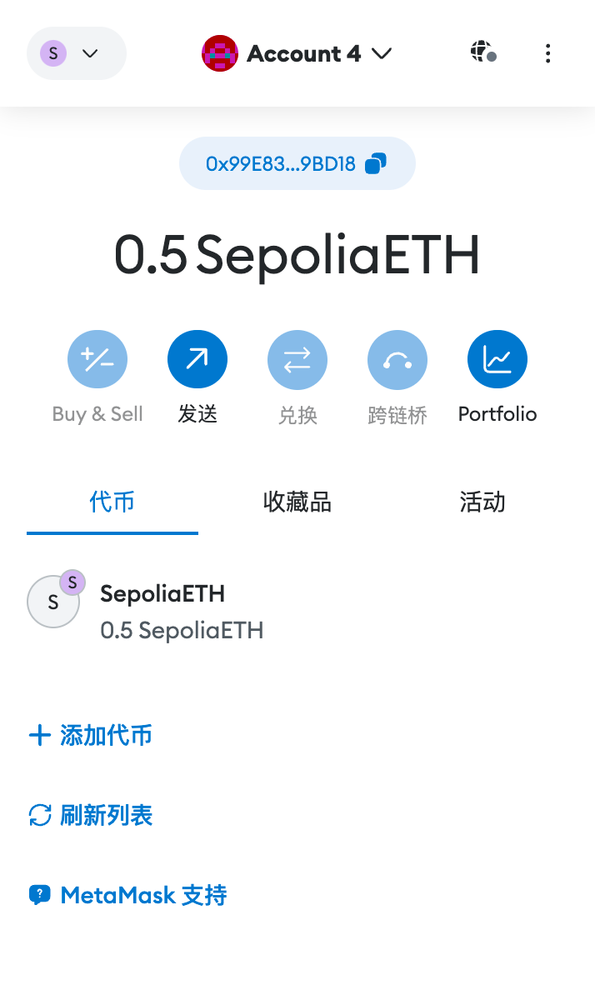

# 基础概念
***
## 参考资料
1、 web3 api：https://web3py.readthedocs.io/en/stable/overview.html  
2、 以太坊文档：https://ethereum.org/zh/developers/docs/intro-to-ethereum  
3、 部分视频资料： https://www.bilibili.com/video/BV1v3411d7kM/
***
## 概念与代码学习
### 前置内容说明
> 代码交互的链基本都是测试链，因为我没有💰，所以需要先简单说明测试链和主链的区别  
> 目的与用途：  
主链：以太坊主链是实际的以太坊网络，其中进行的交易是真实的，涉及真正的资产。这是以太坊网络的公共版本，用于实际的交易和合约执行。  
测试链：测试链是以太坊网络的副本，但用于测试目的。开发者在测试链上测试新的应用程序和智能合约，以确保在将其部署到主链之前它们能正确无误地运行。  
ETH（以太币）的价值：  
主链：在主链上，ETH具有真实的市场价值，可以用于交易、支付矿工费和参与金融活动。  
测试链：测试链上的ETH没有真实的价值。开发者可以从水龙头（Faucet）免费获取测试ETH来测试应用，而这些测试币不能在主链上使用或兑换成真实货币。  
安全性和稳定性：  
主链：主链非常安全，因为它有大量的矿工和节点维护网络的安全与稳定。  
测试链：相比之下，测试链的安全性和稳定性可能较低，因为它的维护和主链相比不那么严格。测试链可能更容易受到攻击，但由于其用途是测试，这种风险是可接受的。  
共识机制：  
主链：以太坊主链已从工作量证明（PoW）转向权益证明（PoS）机制。  
测试链：不同的测试链可能使用不同的共识机制。例如，Ropsten测试链最初使用PoW机制，而其他如Rinkeby和Goerli则使用基于权威证明（PoA）的变体。  
### 连接区块链网络
`provider`提供了连接区块链网络的方法，一共有如下四个对象，他们可以使用不同的方式来连接区块链网络：  
- IPCProvider for connecting to ipc socket based JSON-RPC servers.  
- HTTPProvider for connecting to http and https based JSON-RPC servers.  
- WebsocketProvider for connecting to ws and wss websocket based JSON-RPC servers.  
- AsyncHTTPProvider for connecting to http and https based JSON-RPC servers.  
区块链的api数据交互，遵循JRPC规范。以bsc测试网为案例，使用HTTPProvider连接目标网络。  
bsc testnet network: https://data-seed-prebsc-1-s1.bnbchain.org:8545 
获取测试网地址的方法  
https://cointool.app/rpcServer/cosmos?name=injective  
https://chainlist.org/chain/1  
也可以通过小狐狸等钱包，来查询网络
- 
```python
bsc_test = Web3(Web3.HTTPProvider('https://data-seed-prebsc-1-s1.bnbchain.org:8545'))
bsc_main = Web3(Web3.HTTPProvider('https://rpc.ankr.com/bsc'))
print(f'testnet is connect {bsc_test.is_connected()}')
print(f'mainnet is connect {bsc_main.is_connected()}')
```
在测试网中，货币通常是免费提供的，通常是一个叫“faucet”水龙头的东西来进行货币提供,https://www.bnbchain.org/en/testnet-faucet ,bnb链可以通过这个网址来领取。  
不同的`provider`使用的优先级和适用场景是什么样子的呢？
>IPC (uses local filesystem: fastest and most secure)，代码运行在节点服务器上，就使用ipc  
Websockets (works remotely, faster than HTTP)，远程连接的基础上如果节点支持ws，就优先使用ws  
HTTP (more nodes support it)，节点不支持ws，就使用http
### 获取区块链信息
#### 获取最新的区块信息
根据api，接下来我们可以尝试获取当前区块链的块信息，分别尝试获取测试网和主网目前最新的区块:
```python
bsc_main.eth.get_block("latest")
bsc_test.eth.get_block("latest")
```
当运行这段代码的时候，会出现一个异常
```
web3.exceptions.ExtraDataLengthError: The field extraData is 280 bytes, but should be 32. It is quite likely that you are connected to a POA chain.  
遇到的这个错误是因为连接到了一个使用权威证明（Proof of Authority, PoA）共识机制的区块链。在PoA区块链中，区块头的extraData字段通常超过了标准以太坊网络预期的32字节长度。这是PoA网络的特点，额外的数据用于存储网络中验证者的签名。
```
解决的办法有多种，所以我们先选择eth的测试链来进行查询即可。毕竟文档也是以eth文档作为说明。  
这里使用的测试网络是：https://sepolia.dev/ 进入官方网站可以看到多个rpc地址

随便选择一个即可
```python
eth_test = Web3(Web3.HTTPProvider('https://rpc.sepolia.org/'))
print(eth_test.is_connected())
print(eth_test.eth.get_block('latest'))

True
AttributeDict({'baseFeePerGas': 173581, 'blobGasUsed': '0xc0000', 'difficulty': 0, 'excessBlobGas': '0x4b60000', 'extraData': HexBytes('0xd883010d0d846765746888676f312e32302e34856c696e7578'), 'gasLimit': 30000000, 'gasUsed': 11425765, 'hash': HexBytes('0x22c4e4fd6da2a363e118d3bba66d6095e886a164e1fa49e0fe4f5471712e1d93'), 'logsBloom': HexBytes('0x8108000f063040c00d104642a9002141a03020000001120183001620426a0250200080008000040080202541024401838890301206a051004710548108246430000c844f912742007000528b00e8800185200144a78744008c090081808040420101010c06455279800440c414891d272ec844c5250800a110088410889901008280110c5030c408301019402200c28050114125044004709019b098844008c04208888208068806446200028250c209204a00014444831422c10402104600a900a013629208d0000100200298021040a012000ab04000354204f11400c5681031100046c760184022400800a08605c68608201048a20050808202002128c604'), 'miner': '0x0000000000000000000000000000000000000000', 'mixHash': HexBytes('0x9d9a8919eca3b1b30f7ed7864bb78b392efccbab4540e7090a64a2f01c16d33c'), 'nonce': HexBytes('0x0000000000000000'), 'number': 5348201, 'parentBeaconBlockRoot': '0x2e86dfbb372dbe9caff31cb5c7b7153a0a8fc42dbd0ba94402cff3a05086de2f', 'parentHash': HexBytes('0x0c1414f2776ad1278f9e1c529061d10850e92c357181966c826982b13244ba0f'), 'receiptsRoot': HexBytes('0x7461116738b4f70104926abcb9ed1425813151ec3ff9500e022389eebe0dd141'), 'sha3Uncles': HexBytes('0x1dcc4de8dec75d7aab85b567b6ccd41ad312451b948a7413f0a142fd40d49347'), 'size': 56430, 'stateRoot': HexBytes('0xf019925124e60871cffc5b6368fbe265d0ee6a8e3fc79b3135a99853ef8472d1'), 'timestamp': 1708703976, 'totalDifficulty': 17000018015853232, 'transactions': [HexBytes('0xc4ae83539bb2792a9f86c8f9b0f5171585ac2a0f130b5ce62de6ff318b39af8f'), HexBytes('0xe4c3fce949b2cceed90c74ccd806f1d79d42ec8c15376f2928c8c5adf1d8063e'), HexBytes('0x49853795108bd1283805e030ab2d30619844aa15573f0400d50b5fa16d40e67d'), HexBytes('0x5547d2e52026c01982ebf1025bb0310daf6fb5e9176f120facb61a873210a22e'), HexBytes('0x76620975aa194b07c0a23ebf7cf8d3b3eaa061840dcf8e4d7c2bbbd7c5dadf8d'), HexBytes('0xb97bb765c6c8fc24bd9cbcebd082a67a1fb13bdd63eebdb2869384ee90381f0c'), HexBytes('0xf002069c438eaa5bf1b1079f94ad85b1373b1e8fd25896c967ad959e77fdc060'), HexBytes('0x660403e668657a1825b6d287758f9809708e0b1ee58b560d53444758e11ca93d'), HexBytes('0x3fa3b32e4806d13377ed68c958502fff30e63107e6f9f13990aeb0590e6a1103'), HexBytes('0xf9622d40ae9ae97011996ec19558cb937f9520689e7128b922213a6c8a97c50b'), HexBytes('0x90ba18f6f971fe320576d81cb7392cc3136c92f72cef05185607b61ea5b77760'), HexBytes('0x9e6aa412503f455352b12ad642408ab4da55b2804b245e49b576e0456d840fc2'), HexBytes('0x29a20ab9525e4c70a239e3bed15200f002eb4b70c04dfb0f169ebf3b19417ebf'), HexBytes('0xf0b7eb39beca31ec8a65198562feca3a5e0be3f05020b6ddc6507eb64bcb4a6b'), HexBytes('0xbca1bcf261fbe891b4ea45bd38d25892f6a4c71a870619b7943fe8d9a92ab012'), HexBytes('0xf756222bcda9810c327c716ddee941df9d9e2a29aeee8f418456bfd4bcda463f'), HexBytes('0x9625da4e42ea7cbc89832786bfa8e3280b85d0223955aa9fd52cc33bbeeb97de'), HexBytes('0xa09c56d120fdb8f9ac525ef6e2f49aa00db85124f3eb140c88370e929cc92186'), HexBytes('0x73eb444b3c3ede7cc88eb13f6e9bd54c803512652dc7216cb75bf7ec7e10bcf4'), HexBytes('0x4ebf1cbfc7c9df78044bd22c79802936d3bf8e7136d813b198653f92c44338f4'), HexBytes('0xa421f2f1c6e5050e53717a16bb0d91ccdd54a504a7afb29e246055bb720695f4'), HexBytes('0xc7a7aa28f5ef0321d775479887b15a16df75ea33c680f2c6526b37bcca843717'), HexBytes('0xa2d0e4c2d71c4ccbdb9cc2903dcf7626ec617441bdce90c44a7cec6dbd53fa8a'), HexBytes('0xe9deaded88f35e4035ad1e57499acbde24c5a511a16e82a5aafb98e44d76f155'), HexBytes('0xcd29b2a8ab8b17862a9fa1b5e7b41087c86a5bf3d9ac65af78ec829d02b9d7ea'), HexBytes('0x40bc47ee4ca7a0d73a3192799a8652a9dac570dd619cb6ea685d2afb4ddfb647'), HexBytes('0x4ccb4f0b87d2cf6d05fb00345f1a575fd941a22791d97ed5f9e0283f926e359e'), HexBytes('0xdab50d938b3c2b027a348a92cd69b40399930b5b3e58473e3da2ff7b71b7b87d'), HexBytes('0x7fcf89e8d82bb896debf444e3c43d1bee05ebbb46b2e40f181c12e0148e5d602'), HexBytes('0x61e0f9debfcee714a303532c83e9af368c008284a6fca87f48706695f259881f'), HexBytes('0x7c2498b4664ae644f0ca0eb7203198c906078ee69486c951725af21f3147aa4c'), HexBytes('0xbf5c687587b51ca58f4c52b519373972468ced9561dce955dc85f3a57e068baa'), HexBytes('0xbc6968a91d7ff3f8f5fc20fb3c922aec59c7e2350784697bad12377a43216c0b'), HexBytes('0xe7d640ab7421dc54348d21234d84604b98b39b47137a45593734fafa200a45cd'), HexBytes('0xe31dc049505db0fc85a0ba191d5fa34d8d19c32e2c9d82eb6196ad8764185b5f'), HexBytes('0x47c7c5a1798f8fe6309e597c98175ee22f33a0192aa83855ac6cdae2613ba3a3'), HexBytes('0x55a1fb594dbc42486e0d0dae7d884f9eabd2717daa8be653a5d1d73fdcbb8d9e'), HexBytes('0x57b13e71657119b2a4406f050e89fea249b2385c48965eb6a6cdd7f3d743d0f3'), HexBytes('0xa4dbb9d93857dc44eea282290a850f64f326b783d96e7d3380ba91c7fcd8420d'), HexBytes('0xdba631765ba335b1148a28ba09e839bacd8c27c047a81fbd6b2b8598b05ba4e6'), HexBytes('0x587ae0ed7e5a5bed0ad34683428f61c1e32fde2b2d55f95a3124c66052785ac9'), HexBytes('0x912805ba60379de8e2ddd8b3212a5a4bae8e87294e2a1679660730e53a0fd93c'), HexBytes('0xb85863db1c6a723fed85d5599fa5ba9498ea90b0e6beed1dc43b22d5e5de6ee5'), HexBytes('0x447f952b930a5a8c1f2292e4b881d190d4a75adc35f955890a91ba2eb8beb0c3'), HexBytes('0xd170acfbda7ea8b63f6046b85ffadae6c89832f7185514cb2078e4faa510cda4'), HexBytes('0x9528ab9f0e9a2c00b789d4728a3cdc768b98b8e4ef73cb2de1634aab625e31fd'), HexBytes('0xdb608fdbdf3bba8b80998f640ecdd93f39b18abda0c9aeee438729d765043f0b'), HexBytes('0x874facd938428fd478e2f2fb1d1af7bf8869a3245da2563093082a657510ca35'), HexBytes('0x12cd27bb2d5332a8eea93787a2d06923f821914a01f7e9f7d351faa2033bee76'), HexBytes('0x8402d786abaf28bf38ecec6911e603ff1782c0df7557b780464eeb7063e74ff3'), HexBytes('0xe64fa94ff7ce58ace57eed58fc3cc1ace3f576b86a87cd89dc5865fbfa1751cd'), HexBytes('0x64adfbc4395c463ffb3a25ce2b71c6fb4df26dc244733d49d02de9046571c312'), HexBytes('0x37ac6d54a85b9d232133696ecd97a48f7781d3af748696c890741ee9dbc6fd53'), HexBytes('0xc03230f2636cab332273932e105617078e023886dc27861cd8f52582634944d8'), HexBytes('0xed87a1e4b470d15e36bcd26f507e1969a71d12731b23430dcc202a20fe4fa797'), HexBytes('0xde96644afe8a08336b40c2486d8be0dd3639f6c46beced53ded69b71add6447c'), HexBytes('0x1abc60d38dac6e1652720167fc80a8383efd1f2d898922a3ec227c570cb1ad13'), HexBytes('0x4fee26a75e1c251ba825eb66e7183bc5e85c008530f485e73ab41c79102e00ab'), HexBytes('0x851d79daa50030eee278c1e7bceb8e34a8da72fbd4c44b206b7855ddae64780e'), HexBytes('0x91f19ff43518d5c7708c604d41f6f08935cea1fb97f0279372e7be95f4f39a8a'), HexBytes('0x4022f65ad18a63c7e901390990b31d7c092d7fd5bfd90a81dfae8d39658ed994'), HexBytes('0xb6059f2e2eb1ff56160db066f91c186ce2708848fc226e663dd809b320454323'), HexBytes('0x720ef21e7c5f86495118134d5a3a75109c16cd389c811b3ab269dc678e1e8eec'), HexBytes('0xd9ad47d6a41a2342485bd346fa7b177851179a00848ae641b884904455bbb35b'), HexBytes('0xe2786055ee71fc91d955c93a3483e072b9f6931a3df816c5c1912824cf4e956b'), HexBytes('0xab6ca9ea9d963f685c591f734455e4278697c35155286186e407eaec30356905'), HexBytes('0xc8d44612e6218a60ea4e822986de2f0aa3175b4d92f18ca789100a3cd854539b'), HexBytes('0x82da12e769827ddf3250a417453951a961456b8cd1740b840300ae5d41b0cabf'), HexBytes('0x5fb82d15b239ea03f1a096b9930a4d4808323a5d8155717e44dd19e13be94c84'), HexBytes('0xdc147bae2ed9e93afa18a0c331854be6575d2ddd95403845eb089d27b40c73b2'), HexBytes('0x8e501e127ce288f28a74e8a9f035e62177bed52724012c95d4cfb6493ddfbaec'), HexBytes('0x8568c6dabfcd3f3d5dfe1aea21b4efae337d156eaf7ddd145b02035bd0269be3'), HexBytes('0x7461645e2d66f6aeae13855d66be28db9fba949d854aedd5f75786f0da1232d0'), HexBytes('0x02a595d13573d4028c0b229d99288c92a5c16d20a72deb5768ad25bdfc58b33b'), HexBytes('0xf5d13f35616d6ee5bcb417ff65a4944c2a46422b741b97067e76f270cb9fdd4e'), HexBytes('0x1d594d049cfbe6f347fbe17cbfa6615719855a5a18f21e947b01d29c0050a5d4'), HexBytes('0x5e337e6c67f50183be0bd5b2d82ce0c79cd85392a936f94efe46fecbf1267303'), HexBytes('0xd496512b93cd2fb227e3de8b9ed2c85d5965d6a2b6f403b74cb268a9053912fd'), HexBytes('0x34b37a5b08449f21b3171939ef6a177cb7120548e93b69a97dce1a2483bedf69'), HexBytes('0x2d302c1c060b791ed9c684ca4817554c4622d143c6a54033ce87152129d762f6'), HexBytes('0x279fd9875595b206f5791b42b668fcad0f47021ea88d781adcec63d94a98570c'), HexBytes('0x87b3fd0baff2f8326975079c4a42b905535ea2f15c881965b4345915cf257319'), HexBytes('0xce27e43e01495be7d0a78361031c08cab9e9569c9b4a893254a5d2de806f272f'), HexBytes('0x3fb0ba4e7c2fa7c8d8682eaddc03de5106a3034521daa7711a78f597f9b75d4e'), HexBytes('0xfc676bb4e9dbc3a6256734dff7a2517c23bb18ef31803717ff446c58b0e4591e'), HexBytes('0x16ada67ced2e608001558a600664c357049c2549846535c36c360ab56a4c1282'), HexBytes('0x3a9811d213a38c66df56ff0eaa064cac93bdf4792b021763e2786e8a5149a907'), HexBytes('0x38f9d495672d042e74d657c92b519efc22e8a260f9cf84f112b6e353011db21d'), HexBytes('0x8757307391212036c0988c2e2360be94ba6563c2bd28e3b044ea7cfd0ccaeb33'), HexBytes('0x40dffd62c240c32f579bfbfea96b4fce01d925970a676062157c242b1fded480'), HexBytes('0x70a4fa6c2f8b78cd66d86c03f1bc1d4430278fc0b868870c99d53fae6b3cabc1'), HexBytes('0xe7b224baaee9e9c40959bccaff2a2afa4325e65e9bd9c8efc51d6c3f47c0b428'), HexBytes('0xefdf204938d2b27b0fdf59c2ba63adbdf633a8d145d13c5688571fce3c2d05e2'), HexBytes('0x438bfb28c4c9268d82328683a60c1d0e2ca09f4bb7634dae10657ae3ebffc772'), HexBytes('0x05dfe51c7be0d7f72de35e6e4c304c371020eb5454eaaf0e07e4115e277032f4'), HexBytes('0x6ec2509b077010330f47d81f0bf341560f708a3d3c77da5e78c99a9e1dbdda77'), HexBytes('0x901c8fba4289b234c01ca0526178088570f2cf0ae844d8246111af8c56972d00'), HexBytes('0xc53afdb808f3dfe5ac345c2eb484965443eb89a1915c67c2e3a2a1eb19573c11'), HexBytes('0x88fada54878d0dd07f2aa5dab128da4648179484dffe92cf734c09b73a8df056'), HexBytes('0x9edf8316b7c58d1b9f34d1fd38999da18128a84aa047ab712cc1f0881311d961'), HexBytes('0x723bf4d9e147c1576928da3372e37a9b6212bab14caf4da634cd742950e15f5f'), HexBytes('0x698c70d524d0918df741b04c745f65de8003ca4247118dce34bc85f0ac2dd782'), HexBytes('0x72854faa7a52fde325dd43ab834b91d6125094308ac62b0921fa6f60d0095c59')], 'transactionsRoot': HexBytes('0x850af922596ffaddc66cca18d65cd4629b25fda30e715688671ecd0c412dedc0'), 'uncles': [], 'withdrawals': [AttributeDict({'index': 37710407, 'validatorIndex': 444, 'address': '0x25c4a76E7d118705e7Ea2e9b7d8C59930d8aCD3b', 'amount': 1888}), AttributeDict({'index': 37710408, 'validatorIndex': 447, 'address': '0x25c4a76E7d118705e7Ea2e9b7d8C59930d8aCD3b', 'amount': 1888}), AttributeDict({'index': 37710409, 'validatorIndex': 452, 'address': '0x25c4a76E7d118705e7Ea2e9b7d8C59930d8aCD3b', 'amount': 1888}), AttributeDict({'index': 37710410, 'validatorIndex': 456, 'address': '0x25c4a76E7d118705e7Ea2e9b7d8C59930d8aCD3b', 'amount': 1888}), AttributeDict({'index': 37710411, 'validatorIndex': 457, 'address': '0x25c4a76E7d118705e7Ea2e9b7d8C59930d8aCD3b', 'amount': 1888}), AttributeDict({'index': 37710412, 'validatorIndex': 458, 'address': '0x25c4a76E7d118705e7Ea2e9b7d8C59930d8aCD3b', 'amount': 1888}), AttributeDict({'index': 37710413, 'validatorIndex': 459, 'address': '0x25c4a76E7d118705e7Ea2e9b7d8C59930d8aCD3b', 'amount': 1888}), AttributeDict({'index': 37710414, 'validatorIndex': 466, 'address': '0x25c4a76E7d118705e7Ea2e9b7d8C59930d8aCD3b', 'amount': 1888}), AttributeDict({'index': 37710415, 'validatorIndex': 468, 'address': '0x25c4a76E7d118705e7Ea2e9b7d8C59930d8aCD3b', 'amount': 1888}), AttributeDict({'index': 37710416, 'validatorIndex': 469, 'address': '0x25c4a76E7d118705e7Ea2e9b7d8C59930d8aCD3b', 'amount': 1888}), AttributeDict({'index': 37710417, 'validatorIndex': 471, 'address': '0x25c4a76E7d118705e7Ea2e9b7d8C59930d8aCD3b', 'amount': 1888}), AttributeDict({'index': 37710418, 'validatorIndex': 482, 'address': '0x25c4a76E7d118705e7Ea2e9b7d8C59930d8aCD3b', 'amount': 1888}), AttributeDict({'index': 37710419, 'validatorIndex': 490, 'address': '0x25c4a76E7d118705e7Ea2e9b7d8C59930d8aCD3b', 'amount': 1888}), AttributeDict({'index': 37710420, 'validatorIndex': 494, 'address': '0x25c4a76E7d118705e7Ea2e9b7d8C59930d8aCD3b', 'amount': 944}), AttributeDict({'index': 37710421, 'validatorIndex': 495, 'address': '0x25c4a76E7d118705e7Ea2e9b7d8C59930d8aCD3b', 'amount': 944}), AttributeDict({'index': 37710422, 'validatorIndex': 497, 'address': '0x25c4a76E7d118705e7Ea2e9b7d8C59930d8aCD3b', 'amount': 944})], 'withdrawalsRoot': HexBytes('0x893bb57fcde1393a6ccf9e41b3fe231cf54d280a7c54078d7c422e206eaca02d')})
```
### 创建私钥、钱包地址
#### 本地密钥与托管密钥
> An Ethereum private key is a 256-bit (32 bytes) random integer. For each private key, you get one Ethereum address, also known as an Externally Owned Account (EOA).
以太坊私钥是一个 256 位（32 字节）的随机整数。对于每个私钥，您将获得一个以太坊地址，也称为外部拥有的账户 （EOA）。  
In Python, the private key is expressed as a 32-byte long Python bytes object. When a private key is presented to users in a hexadecimal format, it may or may not contain a starting 0x hexadecimal prefix.
在 Python 中，私钥表示为 32 字节长的 Python bytes 对象。当私钥以十六进制格式呈现给用户时，它可能包含也可能不包含起始 0x 十六进制前缀。
#### 本地密钥的常见用途
1. sign a tx 签署交易
2. sign a contract tx 签署合约交易
3. sign a message 对邮件进行签名
4. verify a message 验证消息
#### 创建私钥
> Each Ethereum address has a matching private key. To create a new Ethereum account you can just generate a random number that acts as a private key.  
每个以太坊地址都有一个匹配的私钥。要创建一个新的以太坊账户，您只需生成一个用作私钥的随机数。  
A private key is just a random unguessable, or cryptographically safe, 256-bit integer number  
私钥只是一个随机的不可猜测或加密安全的 256 位整数  
A valid private key is > 0 and < max private key value (a number above the elliptic curve order FFFFFFFF FFFFFFFF FFFFFFFF FFFFFFFE BAAEDCE6 AF48A03B BFD25E8C D0364141)  
有效的私钥> 0 且最大私钥值<（椭圆曲线顺序 FFFFFFFF FFFFFFFF FFFFFFFF FFFFFFFF FFFFFFFE BAAEDCE6 AF48A03B BFD25E8C D0364141）  
Private keys do not have checksums.   
私钥没有校验和。

使用如下代码可以生成一个私钥和一个账户地址
```python
w3 = Web3()
acc = w3.eth.account.create()
print(f'private key={w3.to_hex(acc.key)}, account={acc.address}')

private key=0x6807f8e3b44b762dcc00562373bb921be5c1adeab0e68baac77d375c4403eb9b, account=0x99E83432EF5a04b68d39Eda395d71BE25359BD18
```
现在可以复制当前私钥，导入到小狐狸钱包或者其他钱包中，进行图形化使用.而账户地址,其实就是我们日常口述的钱包地址。

前文提到了主网与测试网，这里我们将去测试网水龙头领取eth进行后续的操作，如果你想在主网进行使用的话，需要自己充值eth进入账户。  
通过 https://sepoliafaucet.com/  水龙头领取对应的eth，每天可以领取0.5eth。需要注册一个账号，会有验证码的要求。通过验证码后把自己的钱包地址输入在这里即可。
其他的平台或多或少都有一些任务要求。


账户上有钱了之后，我们就可以通过api中提供的相关函数来进行操作了
#### 钱包方法
##### 钱包地址
> EIP55 是一种以太坊地址的校验和格式，用于减少因地址被错误输入而导致的错误或损失。在这种格式中，地址的大小写被用来作为一种校验和。

api一共提供了三个方法：  
```python
wallet_address = '0x99E83432EF5a04b68d39Eda395d71BE25359BD18'
print(Web3.is_address(wallet_address))
print(Web3.is_checksum_address(wallet_address))
print(Web3.to_checksum_address(wallet_address))
```
##### wei、gwei、ether
>以太坊中的货币单位包括Wei、Gwei和Ether，它们之间的换算关系如下：  
Wei：是以太坊系统中的最小货币单位。所有交易和余额都可以精确到Wei。  
Gwei（Gigawei）：1 Gwei 等于 1,000,000,000 Wei。Gwei是以太坊中最常用的单位，尤其是在指定燃气价格（Gas Price）时。  
Ether：是以太坊中最常见的单位，通常用于交易和平衡计算。1 Ether等于 1,000,000,000,000,000,000 Wei（1e18 Wei）。  
具体的换算关系如下：  
1 Ether = 1,000,000,000 Gwei    10的9次方  
1 Ether = 1,000,000,000,000,000,000 Wei   10的18次方  
1 Gwei = 1,000,000,000 Wei   10的9次方
##### 获取当前地址的钱余额与单位转换
使用测试网的实例化对象，调用`eth.get_balance`可以获取当前钱包余额，通过`Web3.from_wei`或者`Web3.to_wei`可以自由的转换单位。  
在eth上交易消耗的`gasfee`就是`gwei`作为单位
```python
#获取当前钱包余额
eth_test = Web3(Web3.HTTPProvider('https://rpc.sepolia.org/'))
balance = eth_test.eth.get_balance('0x99E83432EF5a04b68d39Eda395d71BE25359BD18')
print(f'当前地址 {wallet_address} 的余额是 {balance} wei')
print(f'当前地址 {wallet_address} 的余额是 {Web3.from_wei(balance,'ether')} e')
print(f'当前地址 {wallet_address} 的余额是 {Web3.from_wei(balance,'gwei')} gwei')

当前地址 0x99E83432EF5a04b68d39Eda395d71BE25359BD18 的余额是 500000000000000000 wei
当前地址 0x99E83432EF5a04b68d39Eda395d71BE25359BD18 的余额是 0.5 e
当前地址 0x99E83432EF5a04b68d39Eda395d71BE25359BD18 的余额是 500000000 gwei
```
