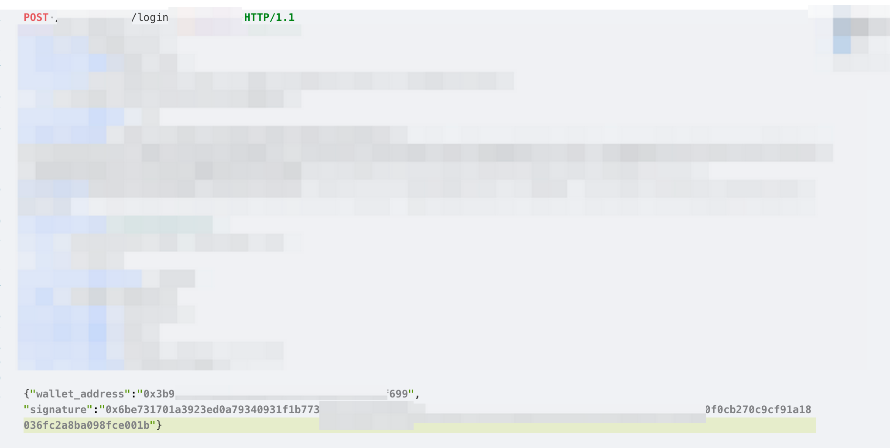

# sign 签名
## 概述
这一节是为了解决在交易或者合约交互或者登陆钱包的过程中遇到对某个消息进行签名或者对交易进行签名的问题.  
>这一节为什么被我单独拿出来，是因为之前在分析某个项目的时候，需要登陆钱包。而登陆钱包的请求则是通过自己的私钥，对某个消息进行签名就行了。但是当时不会，通过yak抓到包了但不知道有什么意义。只能说可惜。

## 对某个消息签名
当时的场景：  
  
而现在回过头来看这个问题，第一点是可以通过钱包获取到要签名的消息内容，第二则是可以通过js调试，来获取到目标的消息.  
接下来我们就可以尝试通过代码来对消息进行签名了，假设当前的消息内容是`313 fuck free world`,然后使用之前注册的账号的地址和私钥。
```python
import web3
from web3 import Web3
from eth_account.messages import encode_defunct

msg = "313 fuck free world"
wallet_address1 = '0x99E83432EF5a04b68d39Eda395d71BE25359BD18'  # 有余额的测试地址
wallet_address1_pvk = '0x6807f8e3b44b762dcc00562373bb921be5c1adeab0e68baac77d375c4403eb9b'  # 当前地址的私钥

eth_test = Web3(Web3.HTTPProvider('https://rpc.sepolia.org/'))
print(f'连接测试网: {"成功" if eth_test.is_connected() else "失败"}')

msg = encode_defunct(text=msg)
print(f'格式化后的msg {msg}')

signed_msg = eth_test.eth.account.sign_message(msg,wallet_address1_pvk)
print(f'签名后的msg {signed_msg}')
print(f'签名后的msg类型是 {type(signed_msg)}')

连接测试网: 成功
格式化后的msg SignableMessage(version=b'E', header=b'thereum Signed Message:\n19', body=b'313 fuck free world')
签名后的msg SignedMessage(messageHash=HexBytes('0xdc57723ea9b324b77eea04067365e1854e0b516241e87c29a4d1f255e0e1a8ed'), r=13587921379995412209738732335311718851715483528391733152153635963832332854950, s=21162271105333464024059448134248284813940006022343777601273231027790247425195, v=28, signature=HexBytes('0x1e0a7daf93cdedd18811c1140e89e635cb28939fce18211fc69e8235faf626a62ec96bc576d439b4ef2b1b7e94a335d261bfb9ee238105def476a8204334f4ab1c'))
签名后的msg类型是 <class 'eth_account.datastructures.SignedMessage'>
```
这样我们就完成了一个消息的签名。接下来我们输出的对象属性进行解析。
>**messageHash**: 这是消息的哈希值。在签名过程中，原始消息首先被哈希化（通常使用Keccak-256哈希算法），以生成一个固定大小的哈希值。这个哈希值代表了原始消息，并用于签名过程。  
r, s, v: 这些是构成ECDSA签名的三个组成部分。
r: 是签名的一部分，它是从椭圆曲线点乘运算的结果中得出的。  
s: 也是签名的一部分，它是关于私钥、消息哈希值以及r的运算结果。  
v: 这是签名的恢复ID，用于从签名中恢复出发送者的地址。在以太坊中，v 通常是27或28，但也可能因链上不同的环境（如不同的测试网或主网）而有所不同。  
**signature**: 这是实际的签名，以字节串的形式表示。它是由r, s, 和v 组合而成的，并且可以用于在链上或链下验证消息的签名者。在以太坊中，它通常是一个65字节的字符串，其中前32字节是r值，接下来的32字节是s值，最后一个字节是v值。  

## 验证某个消息
验证某个消息，实际上就是来验证当前这个消息是谁签名的，所以最后可以得到一个地址。也是当前私钥的地址。  
```python
print(f'从消息中恢复的地址是: {eth_test.eth.account.recover_message(msg, signature=signed_msg.signature)}')
```  
需要注意的是`recover_message`函数接受的参数，一个是原来的msg，另一个则是签名之后的生成的对象中的`signature`属性。
## 解决之前的登陆问题
  
在这个数据包中，我们现在的知识水平可以很确定他发送的请求内容是什么，即我们对msg进行签名，随后将地址和指纹打成json的请求，发送到服务端，服务端此时会响应我们一个jwt的token.  
那么我们可以快速构建这个登陆请求,并且拿到相关的token。如此朴实无华的操作，我一个月前居然不会，我真🥬  
```python
    headers = {
        "User-Agent": "Mozilla/5.0 (Windows NT 10.0; Win64; x64) AppleWebKit/537.36 (KHTML, like Gecko) Chrome/109.0.0.0 Safari/537.36",
        "Content-Type": "application/json",
        "Accept": "application/json, text/plain, */*"
    }
    url = "https://somehost/login?via=wallet"
    data = {
        "wallet_address": wallet_address,
        "signature":eth_test.eth.account.sign_message(msg, wallet_address1_pvk).signature
    }
    resp = requests.post(url=url,headers=headers,json=data)
    token = resp.json()["data"]["accessToken"]
```
接下来的内容得空一下，我们先看智能合约，再来签名与智能合约进行交互