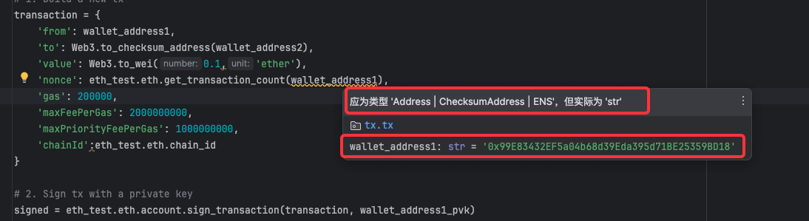
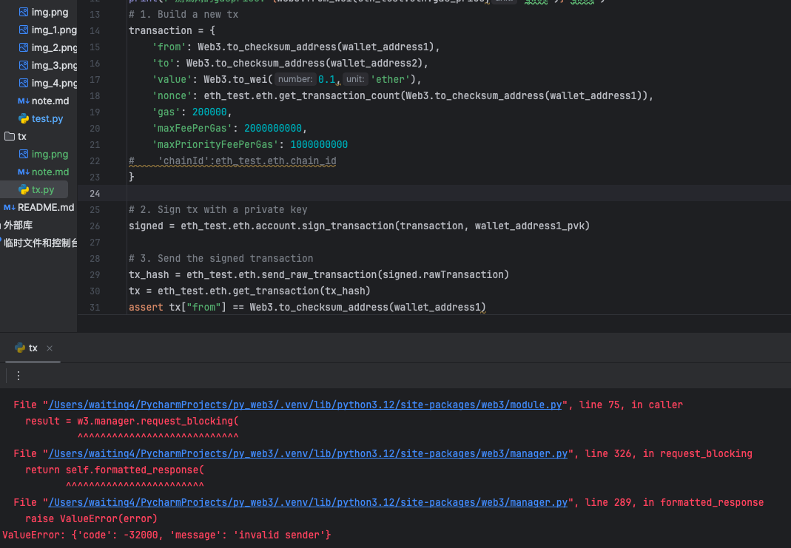
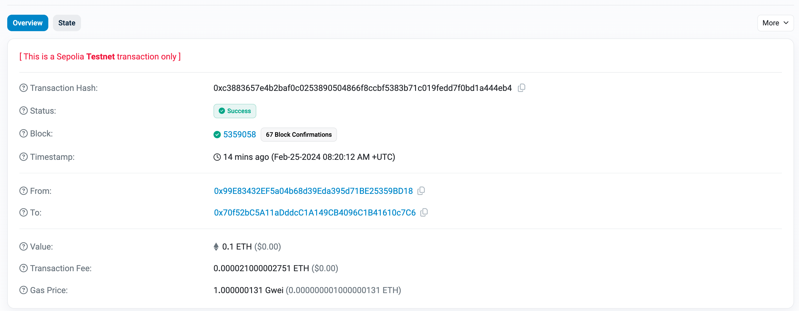
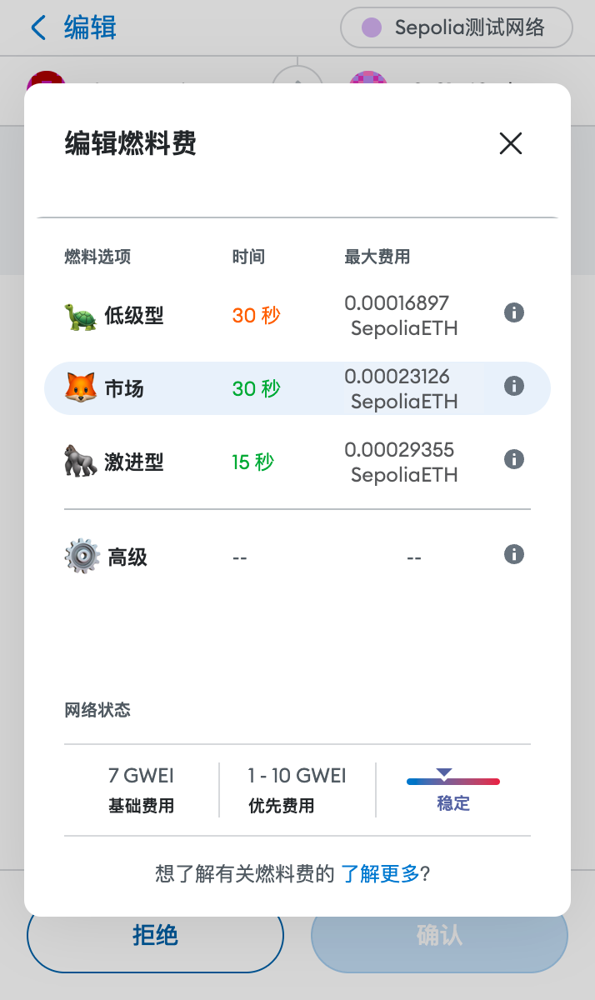

# 交易
## 概述
在test_1中已经完成了本地钱包生成，测试链货币领取，接下来就可以在测试网中进行交易。交易之前我们先创建另一个测试网的账号，方便待会交易。
## 前置工作准备
### 交易地址准备
````python
wallet_address1='0x99E83432EF5a04b68d39Eda395d71BE25359BD18' #有余额的测试地址
w3 = Web3()
acc = w3.eth.account.create()
wallet_address2=acc.address
wallet_address2_pvk=w3.to_hex(acc.key)
print(f'private key={w3.to_hex(acc.key)}, account={acc.address}')

private key=0x21e40cdcacc88dff289a1e4d635614601b724b961003729eae5bfe7327b0f0c7, account=0x70f52bC5A11aDddcC1A149CB4096C1B41610c7C6
````
### eth-tester 与 测试网选择
因为最终的目标肯定是和链上进行交互，所以我们不选择eth-tester。如果你有浏览web3py的api，你会发现在第一天`Provider`模块中，会存在一个`EthereumTesterProvider`.  
这里稍微对`EthereumTesterProvider`进行一下介绍：
>EthereumTesterProvider是用于以太坊开发中的测试和模拟。它提供了一个轻量级、简单的环境，用于测试智能合约和以太坊交互，而无需连接到真实的以太坊网络。  
> 模拟以太坊网络：eth-tester 模拟了以太坊区块链的运行环境。这意味着开发者可以在没有实际区块链网络的情况下测试他们的智能合约和应用。  
自动签名交易：在 eth-tester 中，测试账户发送的交易是自动签名的。这样，开发者就不需要担心交易签名的复杂性，可以更加专注于测试智能合约的逻辑。  
无需连接 RPC 地址：因为 eth-tester 是一个完全模拟的环境，所以它不需要连接到任何外部的节点或 RPC 地址。这使得它在测试初期非常方便快捷，因为设置和配置要求极低。  
测试网与 eth-tester 的区别：虽然测试网（如 Ropsten 或 Rinkeby）也用于测试目的，但它们是实际的区块链网络，需要连接到网络节点。使用测试网时，交易虽然不花费真实的以太币，但仍然需要通过网络进行广播和确认。而 eth-tester 完全在本地运行，不涉及实际的区块链网络。    
使用场景：如果你希望在完全控制的环境中快速测试智能合约，eth-tester 是一个很好的选择。但如果你的目标是测试智能合约在更接近生产环境的网络中的表现，那么使用测试网会更加合适。  

所以我们选择基于测试网进行交易，那么就需要了解Gas机制和一次交易过程中有那些属性，以及具体该如何对这些属性进行处理。
## Gas
以太坊中的Gas机制是一个关键的概念，用于度量执行交易或智能合约操作所需的计算工作量。这个机制有助于保持网络的安全性、效率，同时防止滥用资源。  
对于Gas，以太坊文档进行了很好的解释：https://ethereum.org/zh/gas
1. 什么是Gas？  
计算工作量单位：Gas是执行以太坊网络中的操作（如交易或智能合约执行）所需计算工作量的单位。  
预防网络拥堵：通过限制每个区块可以包含的Gas总量，以太坊能够避免网络拥堵和滥用。
2. Gas与以太币（Ether）  
尽管Gas是一个度量单位，但它也与以太币相关联，因为每个Gas单元都需要用以太币来支付。  
用户在发起交易时设置一个“Gas价格”，即他们愿意为每个Gas单位支付多少以太币。这通常以“Gwei”（1亿分之一以太币）表示。
3. Gas Limit 和 Gas Price  
Gas Limit：交易发起者设定的他们愿意为执行该交易支付的最大Gas量。这是为了防止交易过程中发生意外（例如无限循环）导致的过高费用。  
Gas Price：用户愿意为每单位Gas支付的以太币数量。Gas价格越高，矿工越可能优先处理该交易。
4. 计算交易费用  
交易费用（Transaction Fee）= Gas使用量 × Gas价格。  
实际费用取决于交易的复杂性、网络状况和设置的Gas价格。  
5. Gas与智能合约  
执行智能合约操作通常需要更多的Gas，因为它们通常比简单的以太坊转账更复杂。  
智能合约的Gas成本取决于合约的复杂性和执行的具体操作。  
6. Gas与矿工  
矿工选择要处理的交易。高Gas价格的交易更可能被矿工优先选择，因为它们提供更高的激励。  
7. 未使用的Gas  
如果交易消耗的Gas少于Gas Limit，未使用的Gas将被退还给用户。
### 查询当前网络的gasprice
```python
eth_test = Web3(Web3.HTTPProvider('https://rpc.sepolia.org/'))
print(f'测试网连接: {eth_test.is_connected()}')
print(f'测试网的gasprice: {Web3.from_wei(eth_test.eth.gas_price,'gwei')} gwei')

测试网连接: True
测试网的gasprice: 1.000001043 gwei
```
Gas limit 通常是一个固定的值`21000 wei`,在计算一次交易消耗的交易费时，计算的公式如下所示：  
21000 * Gas price = > 在上方我们的Gas price是`1.000001043 gwei`,那么本次消耗的gasfee:`Gasfee= 21000 x 1.000001043 X 10的9次方`
### 发送交易
使用 web3.py 发送交易有两种方法:`send_transaction()` 和 `send_raw_transaction()`   
在这个过程中，api的实例代码使用的是`eth-tester`进行的交易，这一步就是链接到rpc网络，所以我们使用测试网同理.  
使用`send_raw_transaction()`的时候一共分为三步  
1. 构建交易的json
2. 对消息进行签名
3. 使用`send_raw_transaction()`方法进行交易

在交易的过程中，有许多参数，接下来就以领取了0.5e的账户转账到没有领取的账户。构造交易json并进行一次交易，最终成功交易的代码如下：
```python
import web3
from web3 import Web3

wallet_address1 = '0x99E83432EF5a04b68d39Eda395d71BE25359BD18'  # 有余额的测试地址
wallet_address1_pvk = '0x6807f8e3b44b762dcc00562373bb921be5c1adeab0e68baac77d375c4403eb9b'
wallet_address2 = '0x70f52bC5A11aDddcC1A149CB4096C1B41610c7C6'  # 新注册的地址
wallet_address2_pvk = '0x21e40cdcacc88dff289a1e4d635614601b724b961003729eae5bfe7327b0f0c7'

# 连接到测试网
eth_test = Web3(Web3.HTTPProvider('https://rpc.sepolia.org/'))
print(f'测试网连接: {eth_test.is_connected()}')
print(f'测试网的gasprice: {Web3.from_wei(eth_test.eth.gas_price,'gwei')} gwei')
# 1. Build a new tx
transaction = {
    'from': Web3.to_checksum_address(wallet_address1),
    'to': Web3.to_checksum_address(wallet_address2),
    'value': Web3.to_wei(0.1,'ether'),
    'nonce': eth_test.eth.get_transaction_count(Web3.to_checksum_address(wallet_address1)),
    'gas': 200000,
    'maxFeePerGas': 2000000000,
    'maxPriorityFeePerGas': 1000000000,
    'chainId':eth_test.eth.chain_id
}

# 2. Sign tx with a private key
signed = eth_test.eth.account.sign_transaction(transaction, wallet_address1_pvk)

# 3. Send the signed transaction
tx_hash = eth_test.eth.send_raw_transaction(signed.rawTransaction)
tx = eth_test.eth.get_transaction(tx_hash)
assert tx["from"] == Web3.to_checksum_address(wallet_address1)
```
在写上面代码的时候，实际上我遇到了几个错误，我的操作如下，将原本的api官方代码粘贴，并进行对应的更改,就是将下方代码中的地址和签名所用的私钥修改为自己的。
```python
# 1. Build a new tx
transaction = {
    'from': acct2.address,
    'to': some_address,
    'value': 1000000000,
    'nonce': w3.eth.get_transaction_count(acct2.address),
    'gas': 200000,
    'maxFeePerGas': 2000000000,
    'maxPriorityFeePerGas': 1000000000,
}

# 2. Sign tx with a private key
signed = w3.eth.account.sign_transaction(transaction, pk)

# 3. Send the signed transaction
tx_hash = w3.eth.send_raw_transaction(signed.rawTransaction)
tx = w3.eth.get_transaction(tx_hash)
assert tx["from"] == acct2.address
```
然后不出意料的遇到了错误，主要的错误原因:`ValueError: {'code': -32000, 'message': 'invalid sender'}`  
#### 问题1-地址需要特定格式化
在第一次尝试转账的时候，我并没有使用`Web3.to_checksum_address('地址')`,因为在不同的交易规则下需要使用不同的标准，所以纯粹输入字符串格式的时候，部分实现标准可能不认这个地址。  
在pychram中,当你使用str作为地址的值时，你会遇到编译器的提示，属性类别不对，但你可能仍然可以完成交易。

#### 问题2-交易没有携带链ID
因为一开始是使用的官方api的代码，而官方使用的是eth-tester，这本身与测试网或者主网交易就有很大的差异，后续通过以太坊的文档确认了交易所需使用到的内容。
在代码中如果不使用chainID，是无法完成交易的，如下图所示:

最终成功代码，也就是第一段代码实际上成功的进行了交易，我们可以通过测试网浏览器来查看两个钱包的交易记录，https://sepolia.etherscan.io/  

那么接下来我们要做的事情，就是搞明白整个交易过程中，所涉及到的那些参数，以及每个参数代表什么意思，下方第一个是api的参数，也是我们在测试链进行测试的参数。
```python
    {
    'from': Web3.to_checksum_address(wallet_address1),
    'to': Web3.to_checksum_address(wallet_address2),
    'value': Web3.to_wei(0.1,'ether'),
    'nonce': eth_test.eth.get_transaction_count(Web3.to_checksum_address(wallet_address1)),
    'gas': 200000,
    'maxFeePerGas': 2000000000,
    'maxPriorityFeePerGas': 1000000000,
    'chainId':eth_test.eth.chain_id
    }
```
下面是eth官方文档提供的交易json,你会发现没有提供`chainID`，同时eth官方Gas单价设置为`gasLimit`,那么接下来我们先解析各个参数的含义，在进行这些参数区别的探究。
``` python
{
  from: "0xEA674fdDe714fd979de3EdF0F56AA9716B898ec8",
  to: "0xac03bb73b6a9e108530aff4df5077c2b3d481e5a",
  gasLimit: "21000",
  maxFeePerGas: "300"
  maxPriorityFeePerGas: "10"
  nonce: "0",
  value: "10000000000",
}

```
`from`和`to`这两个字段都很好理解，从什么地址转账到什么地址  
`value` 这个代表这转账多少货币到目标从源转账到目的地址,值的注意的是他的单位是wei,所以在上面那次转账中，使用了`to_wei`方法进行单位换算  
`nonce` 一个有序递增的计数器，表示来自帐户的交易数量,也就是当前钱包一共在链上发起了几次交易。 而取消交易则是在链上发起一个相同的`nonce`但是Gas更高的交易来抢先完成交易
`gas`/`gaslimit` 交易可以消耗的最大数量的燃料单位。 以太坊虚拟机指定每个计算步骤所需的燃料单位。  
`maxPriorityFeePerGas` 优先费用: 这个参数表示你愿意为每个gas单位支付的最高优先级费用。这部分费用是支付给矿工的，以激励他们优先处理你的交易。在网络拥堵时，设置更高的优先费用可以帮助你的交易更快被处理  
`maxFeePerGas` 这是你愿意为每个gas单位支付的最高总费用。它包括maxPriorityFeePerGas和基础费用（base fee）。基础费用是网络自动确定的，用于燃烧（销毁），以此来帮助控制以太坊的供应量和网络拥堵。maxFeePerGas必须高于或等于基础费用加上你设置的maxPriorityFeePerGas
`chainId` 当前以太坊上的区块链的链id  
到这一步，我仍然没理清楚gas的消耗如何进行具体的计算，所以下面会就gas的相关参数进行分析
#### gasprice、gaslimit、maxFeePerGas、maxPriorityFeePerGas
这四个参数都是以太坊上决定交易费用的关键参数，但是自从EIP-1559协议诞生之后，gas的消费发生了改变，我们统一将EIP-1559之前的模式称之为**旧模式**  
`gasprice`实际上是旧时代的残党，在旧模式中，（不考虑网络拥堵的情况下）一次交易的费用是通过`gasprice`（每单位gas的费用）x`gaslimit`（交易消耗的最大gas数）来计算的，他是一个固定的费率。  
进入到新时代，也就是EIP-1559之后，交易发生了变化，引入了动态基础费用（base fee）和优先费用（priority fee）
>基础费用（Base Fee）：这是每个区块自动计算的最小费用，用于交易的处理。基础费用根据网络的拥堵程度动态调整。当网络拥堵时，基础费用上升；当网络不拥堵时，基础费用下降。每个交易都需要支付这个费用，它是从交易费中自动扣除的，并且这部分费用会被燃烧（即从总供应中移除）。  
优先费用（Priority Fee）：也称为小费（tip），这是用户愿意额外支付给矿工的费用，以优先处理他们的交易。用户可以设置这个费用的数额，以提高交易被快速打包的可能性。  
最大费用（Max Fee Per Gas）：这是用户愿意为每个gas单位支付的最大总费用。它包括基础费用和优先费用。  

新时代的计算规则如下：  
**实际支付的总费用 = gaslimit * (基础费用 + 优先费用)**  
但是，实际支付的总费用不会超过最大费用（Max Fee Per Gas），如果最大费用（Max Fee Per Gas）大于基础费用加上优先费用，那么超出的部分将被退还给用户。这就意味着，即使用户设置了较高的最大费用，他们实际支付的往往只是必要的费用（基础费用加优先费用）。  
在这里出现了一个basefee，如何获取当前链的basefee，如何确认当前链使用的是EIP-1559还是旧模式呢？  
##### 获取basefee
在Provider文件中，我们拉取了最新块的信息，在最新块的响应体中，其实就存在basefee。这是一个动态的变化的值。
```python
# 获取当前basefee
latest = eth_test.eth.get_block('latest')
basefee = latest['baseFeePerGas']
print(f'当前链上basefee的值为: {Web3.from_wei(basefee,'gwei')} gwei' )
```
##### 确认是否执行了EIP-1559
最直接的方式是查阅链的官方文档，其次是通过最新的区块中有无basefee这个属性。如果有则证明实行了标准，如果没有就是旧模式。
##### 如何确认当前交易的合理花费
虽然他娘的有钱，但是肯定不能瞎消费，所以在每次交易的时候，我们可以进行人工的确认和干预，如果你着急就多给点，如果不着急就少花点。  
之前打铭文的时候就经常打到了新的铭文还没gas值钱,最后留下来做了传家宝。还有让我记忆很深刻的brc的ethi,还好他娘的当时只换了500u,500u冲进去，gas给低了一个没打到，血亏。  
言归正传，怎么平衡每次的交易费用呢？在小狐狸钱包我们进行交易的时候，通常会看到三个选项，初级、中级、高级。

那么我们根据涂上的金额进行换算大概就能得到当前小狐狸每个级别的费用是多少,当前的basefee是7gwei，优先的费用是1-10gwei。
```python
print(f'低级消费gas {Web3.from_wei(Web3.to_wei(0.00016897,'ether'),'gwei')} gwei,平均每单位gas价格为:{Web3.from_wei(Web3.to_wei(0.00016897,'ether'),'gwei')/21000}')
print(f'中级消费gas {Web3.from_wei(Web3.to_wei(0.00023126,'ether'),'gwei')} gwei,平均每单位gas价格为:{Web3.from_wei(Web3.to_wei(0.00023126,'ether'),'gwei')/21000}')
print(f'高级消费gas {Web3.from_wei(Web3.to_wei(0.00029355,'ether'),'gwei')} gwei,平均每单位gas价格为:{Web3.from_wei(Web3.to_wei(0.00029355,'ether'),'gwei')/21000}')

低级消费gas 168970 gwei,平均每单位gas价格为:8.046190476190476190476190476
中级消费gas 231260 gwei,平均每单位gas价格为:11.01238095238095238095238095
高级消费gas 293550 gwei,平均每单位gas价格为:13.97857142857142857142857143
```
结合当时的basefee，其实我们发现最高费用略小于当前的`basefee x 2`,所以后续每次交易，不紧急的情况下我们定价最大交易fee为basefee的2倍即可。给个2/3的basefee都是财大气粗了💰  
这样一来一次交易的json内容就基本没问题了，那么第二步和第三步实际上就是给交易签名然后发送交易了。到此为止我们至少搞明白了如何使用python发起一次链上交易，并且明白了如何计算费用。  
但是到了主链上肯定会有所不同，所以接下来我们可以通过设置代理来尝试观察一次交易的请求内容。
那我们明天再说


